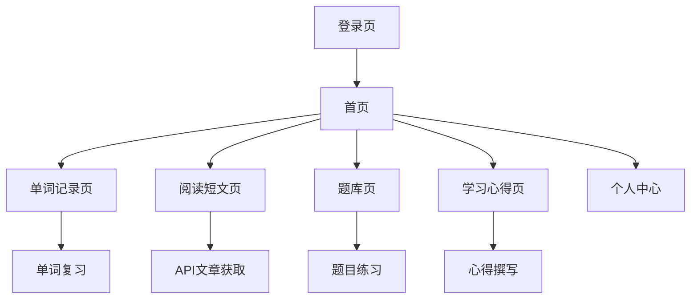

## 1. 产品概述
一个个人英语学习记录网页，帮助用户记录每日学习的单词、阅读短文、练习题目和学习心得。通过简洁大气的界面设计，营造沉浸式英语学习环境。

- 解决用户分散记录英语学习内容的问题，提供统一的学习记录平台
- 面向英语学习者，特别是需要系统性记录和复习的用户群体
- 通过API获取优质英语短文，丰富学习内容

## 2. 核心功能

### 2.1 用户角色
| 角色 | 注册方式 | 核心权限 |
|------|----------|----------|
| 普通用户 | 邮箱注册 | 记录单词、阅读短文、添加题库、写学习心得 |

### 2.2 功能模块
本英语学习记录系统包含以下主要页面：
1. **首页**: 学习概览、今日任务、快速记录入口
2. **单词记录页**: 每日单词添加、复习、搜索功能
3. **阅读短文页**: 每日阅读内容展示、外部API文章获取、阅读笔记
4. **题库页**: 题目练习、答题记录、错题集
5. **学习心得页**: 心得撰写、历史记录、标签分类
6. **个人中心**: 学习统计、设置、数据导出

### 2.3 页面详情
| 页面名称 | 模块名称 | 功能描述 |
|----------|----------|----------|
| 首页 | 学习概览 | 显示今日学习进度、连续学习天数、总单词量统计 |
| 首页 | 今日任务 | 展示今日待完成的学习任务清单 |
| 首页 | 快速记录 | 提供快速添加单词和心得的入口按钮 |
| 单词记录页 | 单词添加 | 输入英文单词、中文释义、例句、音标 |
| 单词记录页 | 单词复习 | 按时间顺序展示历史单词，支持标记掌握程度 |
| 单词记录页 | 搜索功能 | 支持按单词、日期、掌握程度筛选 |
| 阅读短文页 | 文章展示 | 显示文章标题、正文、生词标注、阅读时长 |
| 阅读短文页 | API获取 | 调用外部API获取每日推荐英语短文 |
| 阅读短文页 | 阅读笔记 | 记录阅读感悟、生词、重点句子 |
| 题库页 | 题目练习 | 展示题目内容、选项选择、提交答案 |
| 题库页 | 答题记录 | 显示答题历史、正确率统计 |
| 题库页 | 错题集 | 自动收集错题，支持重新练习 |
| 学习心得页 | 心得撰写 | 富文本编辑器，支持插入图片、格式化文本 |
| 学习心得页 | 历史记录 | 按时间倒序展示所有心得记录 |
| 学习心得页 | 标签分类 | 为心得添加标签，支持按标签筛选 |
| 个人中心 | 学习统计 | 图表展示学习趋势、各模块使用情况 |
| 个人中心 | 设置 | 修改个人信息、学习提醒设置 |
| 个人中心 | 数据导出 | 导出单词、心得等学习数据 |

## 3. 核心流程
用户每日使用流程：
1. 登录后进入首页查看今日学习任务
2. 点击快速记录添加新学习的单词
3. 阅读推荐的英语短文并记录笔记
4. 完成题库中的练习题
5. 撰写当日学习心得
6. 查看学习统计数据

## 4. 用户界面设计

### 4.1 设计风格
- **主色调**: 深蓝色 (#1e3a8a) 搭配白色背景，营造专业学习氛围
- **辅助色**: 金色 (#f59e0b) 用于强调和重要按钮
- **按钮样式**: 圆角矩形设计，hover效果采用轻微阴影
- **字体**: 英文字体优先使用 Georgia，中文使用思源黑体
- **布局风格**: 卡片式布局，顶部导航栏固定
- **图标风格**: 使用简洁的线性图标，突出英语元素

### 4.2 页面设计概览
| 页面名称 | 模块名称 | UI元素 |
|----------|----------|---------|
| 首页 | 学习概览 | 顶部横幅展示励志英语名言，统计卡片采用渐变背景 |
| 首页 | 今日任务 | 任务列表采用勾选框设计，完成项显示绿色对勾 |
| 单词记录页 | 单词添加 | 输入框带有音标提示，支持语音输入图标 |
| 阅读短文页 | 文章展示 | 文章正文采用杂志排版，生词高亮显示 |
| 题库页 | 题目练习 | 答题卡式设计，选项按钮清晰易点 |
| 学习心得页 | 心得撰写 | 富文本编辑器工具栏，支持Markdown语法 |

### 4.3 响应式设计
- 采用桌面端优先设计，确保大屏幕下的最佳体验
- 平板端自适应布局，保持核心功能完整
- 移动端简化界面，突出核心记录功能
- 触摸交互优化，按钮大小适合手指点击

### 4.4 英语元素融入
- 页面标题使用双语显示（中英文）
- 加载动画采用字母拼写效果
- 空状态提示使用励志英语句子
- 图标融入英文字母和标点符号设计