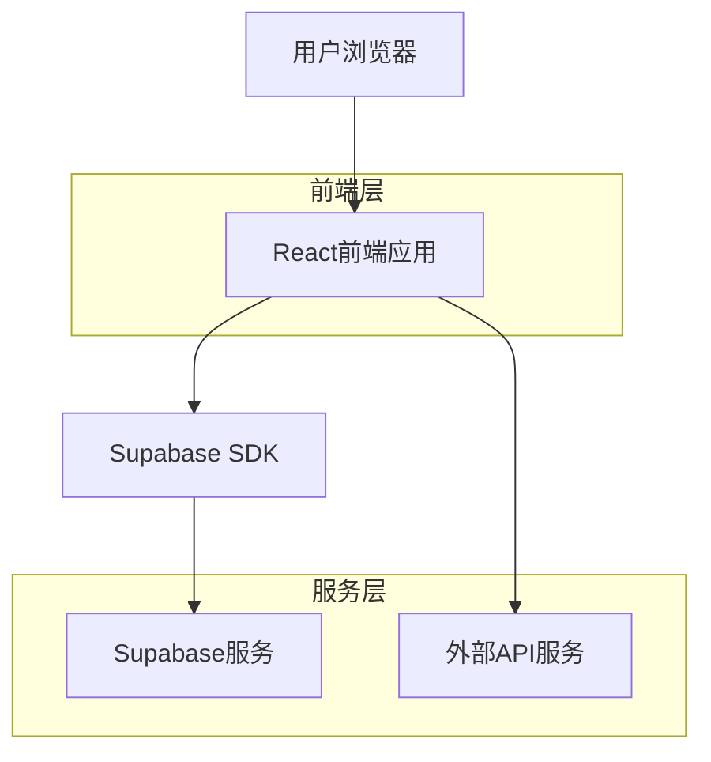
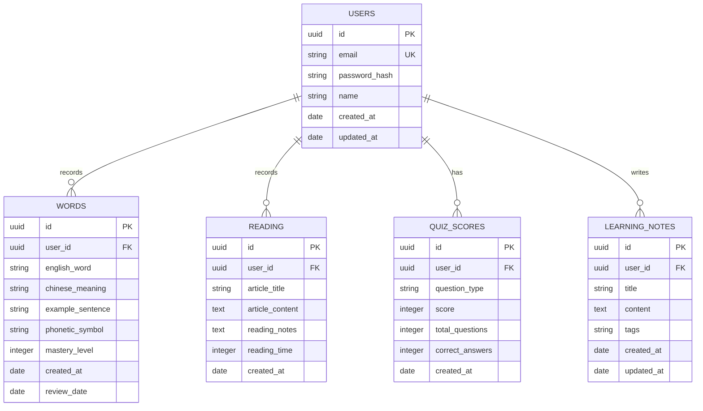

## 1. 架构设计



## 2. 技术描述

- **前端**: React@18 + Tailwind CSS@3 + Vite
- **初始化工具**: vite-init
- **后端**: Supabase (提供认证、数据库、存储服务)
- **外部服务**: 英语短文API (如News API、Quote API等)

## 3. 路由定义

| 路由 | 用途 |
|------|------|
| / | 首页，展示学习概览和今日任务 |
| /login | 登录页面，用户身份验证 |
| /register | 注册页面，新用户注册 |
| /words | 单词记录页面，管理学习词汇 |
| /reading | 阅读短文页面，展示和记录阅读内容 |
| /quiz | 题库页面，练习和管理题目 |
| /notes | 学习心得页面，记录学习感悟 |
| /profile | 个人中心，学习统计和设置 |

## 4. API定义

### 4.1 用户认证相关
```
POST /api/auth/login
```

请求参数：
| 参数名 | 参数类型 | 是否必需 | 描述 |
|--------|----------|----------|------|
| email | string | true | 用户邮箱 |
| password | string | true | 用户密码 |

响应参数：
| 参数名 | 参数类型 | 描述 |
|--------|----------|------|
| user | object | 用户信息 |
| session | object | 会话信息 |

### 4.2 单词管理相关
```
GET /api/words
POST /api/words
PUT /api/words/:id
DELETE /api/words/:id
```

### 4.3 阅读记录相关
```
GET /api/reading
POST /api/reading
GET /api/external-article
```

### 4.4 题库相关
```
GET /api/quiz/questions
POST /api/quiz/answers
GET /api/quiz/statistics
```

## 5. 数据模型

### 5.1 数据模型定义


### 5.2 数据定义语言

用户表 (users)
```sql
-- 创建表
CREATE TABLE users (
    id UUID PRIMARY KEY DEFAULT gen_random_uuid(),
    email VARCHAR(255) UNIQUE NOT NULL,
    password_hash VARCHAR(255) NOT NULL,
    name VARCHAR(100) NOT NULL,
    created_at TIMESTAMP WITH TIME ZONE DEFAULT NOW(),
    updated_at TIMESTAMP WITH TIME ZONE DEFAULT NOW()
);

-- 创建索引
CREATE INDEX idx_users_email ON users(email);
```

单词表 (words)
```sql
-- 创建表
CREATE TABLE words (
    id UUID PRIMARY KEY DEFAULT gen_random_uuid(),
    user_id UUID REFERENCES users(id) ON DELETE CASCADE,
    english_word VARCHAR(100) NOT NULL,
    chinese_meaning VARCHAR(255) NOT NULL,
    example_sentence TEXT,
    phonetic_symbol VARCHAR(100),
    mastery_level INTEGER DEFAULT 0 CHECK (mastery_level >= 0 AND mastery_level <= 5),
    created_at TIMESTAMP WITH TIME ZONE DEFAULT NOW(),
    review_date DATE DEFAULT CURRENT_DATE + INTERVAL '1 day'
);

-- 创建索引
CREATE INDEX idx_words_user_id ON words(user_id);
CREATE INDEX idx_words_created_at ON words(created_at DESC);
CREATE INDEX idx_words_review_date ON words(review_date);
```

阅读记录表 (reading_records)
```sql
-- 创建表
CREATE TABLE reading_records (
    id UUID PRIMARY KEY DEFAULT gen_random_uuid(),
    user_id UUID REFERENCES users(id) ON DELETE CASCADE,
    article_title VARCHAR(255) NOT NULL,
    article_content TEXT NOT NULL,
    reading_notes TEXT,
    reading_time INTEGER DEFAULT 0,
    created_at TIMESTAMP WITH TIME ZONE DEFAULT NOW()
);

-- 创建索引
CREATE INDEX idx_reading_user_id ON reading_records(user_id);
CREATE INDEX idx_reading_created_at ON reading_records(created_at DESC);
```

题库成绩表 (quiz_scores)
```sql
-- 创建表
CREATE TABLE quiz_scores (
    id UUID PRIMARY KEY DEFAULT gen_random_uuid(),
    user_id UUID REFERENCES users(id) ON DELETE CASCADE,
    question_type VARCHAR(50) NOT NULL,
    score INTEGER NOT NULL,
    total_questions INTEGER NOT NULL,
    correct_answers INTEGER NOT NULL,
    created_at TIMESTAMP WITH TIME ZONE DEFAULT NOW()
);

-- 创建索引
CREATE INDEX idx_quiz_user_id ON quiz_scores(user_id);
CREATE INDEX idx_quiz_created_at ON quiz_scores(created_at DESC);
```

学习心得表 (learning_notes)
```sql
-- 创建表
CREATE TABLE learning_notes (
    id UUID PRIMARY KEY DEFAULT gen_random_uuid(),
    user_id UUID REFERENCES users(id) ON DELETE CASCADE,
    title VARCHAR(255) NOT NULL,
    content TEXT NOT NULL,
    tags VARCHAR(500),
    created_at TIMESTAMP WITH TIME ZONE DEFAULT NOW(),
    updated_at TIMESTAMP WITH TIME ZONE DEFAULT NOW()
);

-- 创建索引
CREATE INDEX idx_notes_user_id ON learning_notes(user_id);
CREATE INDEX idx_notes_created_at ON learning_notes(created_at DESC);
```

### 5.3 Supabase访问权限
```sql
-- 基本访问权限
GRANT SELECT ON users TO anon;
GRANT SELECT ON words TO anon;
GRANT SELECT ON reading_records TO anon;
GRANT SELECT ON quiz_scores TO anon;
GRANT SELECT ON learning_notes TO anon;

-- 认证用户权限
GRANT ALL PRIVILEGES ON users TO authenticated;
GRANT ALL PRIVILEGES ON words TO authenticated;
GRANT ALL PRIVILEGES ON reading_records TO authenticated;
GRANT ALL PRIVILEGES ON quiz_scores TO authenticated;
GRANT ALL PRIVILEGES ON learning_notes TO authenticated;

-- 行级安全策略
ALTER TABLE words ENABLE ROW LEVEL SECURITY;
ALTER TABLE reading_records ENABLE ROW LEVEL SECURITY;
ALTER TABLE quiz_scores ENABLE ROW LEVEL SECURITY;
ALTER TABLE learning_notes ENABLE ROW LEVEL SECURITY;

-- 创建策略
CREATE POLICY "用户只能查看自己的单词" ON words
    FOR ALL USING (auth.uid() = user_id);

CREATE POLICY "用户只能查看自己的阅读记录" ON reading_records
    FOR ALL USING (auth.uid() = user_id);

CREATE POLICY "用户只能查看自己的答题记录" ON quiz_scores
    FOR ALL USING (auth.uid() = user_id);

CREATE POLICY "用户只能查看自己的学习心得" ON learning_notes
    FOR ALL USING (auth.uid() = user_id